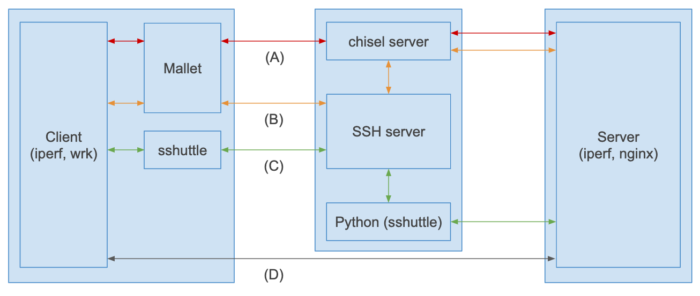

# Mallet

Mallet is a TCP tunnel that works like VPN. This depends on [jpillora/chisel](https://github.com/jpillora/chisel) for actual TCP tunneling.


## Installation

Mallet works on:

- macOS
- Linux

### Binary (Recommended)

Get a binary from https://github.com/ryotarai/mallet/releases

### Source

```
go get github.com/ryotarai/mallet
```

## Example Usage

Example situation:

```
Laptop --> a.example.com --> 10.0.0.0/8
```

First, install chisel to a.example.com by following https://github.com/jpillora/chisel#install and run chisel server:

```
a.example.com$ chisel server --port 8080
```
(Keep this chisel process running)

Then, run Mallet and connect to the chisel server:

```
$ sudo mallet start --chisel-server http://a.example.com:8080 10.0.0.0/8
```
(Keep this mallet process running)

Now, all TCP traffic to 10.0.0.0/8 is forwarded via a.example.com.

## Example Usage with SSH

Example situation:

```
Laptop --SSH--> a.example.com --> 10.0.0.0/8
```

First, install chisel to a.example.com by following https://github.com/jpillora/chisel#install

Second, launch chisel server on a.example.com and forward a port to the server:

```
$ ssh -t -L 8080:127.0.0.1:8080 a.example.com chisel server --host 127.0.0.1 --port 8080
```
(Keep this ssh process running)

Then, start Mallet:

```
$ sudo mallet start --chisel-server http://127.0.0.1:8080 10.0.0.0/8
```
(Keep this mallet process running)

Now, all TCP traffic to 10.0.0.0/8 is forwarded via a.example.com.

## Benchmark



### iperf

| | Throughput |
| --- | --- |
| (D) Direct | 4.98 Gbits/sec |
| (A) Mallet | 1.84 Gbits/sec |
| (B) Mallet over SSH | 1.04 Gbits/sec |
| (C) sshuttle | 0.279 Gbits/sec |

### HTTP benchmark (wrk and nginx)

req/sec

| Concurrency (== Threads) | 1 | 2 | 4 | 8 |
| --- | --- | --- | --- | --- |
| (D) Direct | 10174.78 | 18137.10 | 30328.02 | 39130.81 |
| (A) Mallet | 3560.81 | 6772.88 | 11054.35 | 15576.85 |
| (B) Mallet over SSH | 2465.27 | 4434.10 | 6881.70 | 9767.50 |
| (C) sshuttle | 2416.52 | 4254.54 | 5491.61 | 469.49 (socket write error: 14) | 

avg latency

| Concurrency (== Threads) | 1 | 2 | 4 | 8 |
| --- | --- | --- | --- | --- |
| (D) Direct | 95.85us | 107.50us | 128.92us | 211.63us |
| (A) Mallet | 279.71us | 295.74us | 368.46us | 526.68us |
| (B) Mallet over SSH | 406.29us | 452.08us | 586.36us | 823.74us |
| (C) sshuttle | 411.67us | 468.36us | 725.38us | 1.19ms |

### Environment

- 3 c5.large instances (Amazon EC2)
    - All traffic is in VPC.
- Mallet v0.0.2 (ulimit -n 2048)
- Chisel v1.6.0
- sshuttle v1.0.2
- iperf v2.0.13
    - server: `iperf -s`
    - client: `iperf -c DEST`
- nginx 1.18.0-0ubuntu1
    - HTTP response is "Welcome to nginx" page (Content-Length is 612)
- Ubuntu 20.04

## Troubleshooting

### Cleanup

If Mallet is killed forcibly and it does not shutdown properly, packet redirection rules may remain.
In this case, you can clean them up by `mallet cleanup`.

## Similar Projects

- https://github.com/sshuttle/sshuttle
  - It supports UDP also.

## TODO

- IPv6 support
